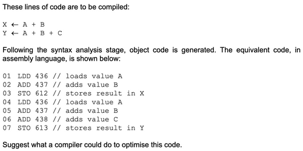
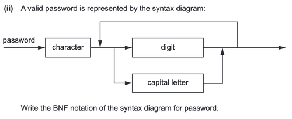

# System Software
## OS
### Tasks
#### Resource maximisation
(9608/32/M/J/19)
#### Memory:
 - Move frequently used instructions to cache for faster retrieval
 - Partition memory to allow multi-tasking
 - Use virtual memory with paging or segmentation
 - Clear parts of main memory as soon as process that was using those parts finishes
##### Disk:
- Compression utility for compressing files so that they use less space and more files can be stored
- Defragmentation utility to make files occupy contiguous disk space to reduce file access time
#### UI provision
GUI or CLI
#### Multi-tasking
- Management of several programs that appear to be running simultaneously

##### Interrupts
- Interrupt - Signal to processor **from a software source or hardware device** about occurrence of an event requiring attention//Transferring control to another routine when a service is required (Rubbish 9618/33/M/J/21)
- When interrupt received, OS may pass control to ISR
- When ISR done, control passed back to OS
- Kernel - low level interrupt handler

##### Scheduling
- Management of processes running on CPU (9618/33/M/J/21) (very similar to multi-tasking but no keyword "simultaneously")
Needed because (source: 9608/33/O/N/19):
    - To allow multitasking
    - To ensure fair usage of processor, peripherals and memory
    - To ensure all processes have the opportunity to finish
    - To ensure CPU always busy

**3 Process States**
- Running - currently executing AND using it's allocated time - for process to start running, processor must be available and process must have highest priority
- Ready/runnable - process is not being executed process in queue and can be run now
- Blocked - can't be run at the moment because waiting for event, e.g. input/output. Event must occur for it to become ready.
When the process is made to stop running, it is "halted".

**Process Control Block (PCB)** - stores state of each process

**Scheduling types**
**Non priority-based**
- Round-robin
    - Each process gets a fixed "time-slice". Once time-slice finished process become ready and next ready process becomes "running". Then go around for every process.
- First come, first served
    - Processes in queue. Each process run until finished or become suspended, then move on to next
**Priority-based**
- Shortest job first
    - Run the process with shortest expected run time first until completion 
    - … or if another process with a shorter run time comes along then run that instead.
- Shortest remaining time
    - Same as ^ but with remaining time instead of total time

#### Memory management
- **Memory manager** module does this
- MM has subprogram called **loader** that allocates memory
- See **Scheduling**

**Memory usage strategies**
- Segmentation
    - Programs divided into segments _by the programmer_
    - Segments can be different sizes
    - Segments loaded when required

- Paging
    - **Reality**
        - Processes need to share main memory but they won't all fit into it
        - Every process is lied to and thinks that it has all the RAM to itself when it actually has a little piece
        - What the process thinks it has is called "virtual memory" or "logical memory"
        - The main memory and the virtual memory is broken down into same size units called pages
        - The pages that don't fit into the allocated part of main memory for a given process are stored in secondary storage
        - They are retrieved when they are needed
        - When requesting data from an address, process requests with a logical memory address.
        - A page table says what address in main memory or secondary storage corresponds to a given logical memory address.
    - **What you need to write to answer the question (source: 9608/33/O/N/19)**
        - Virtual memory is divided into blocks of fixed size called **pages**//programs divided into equally sized blocks called pages (both points are for some reason equivalent and used as often as each other)
        - Main memory is divided into blocks of same size as a page called **page frames**
        - Pages loaded into main memory when needed
        - Virtual memory - extension of main memory using secondary storage - data swapped between RAM and disk
        - Page can be "swapped" into memory at expense of another page
        - Page table (each process has one) stores mapping of (pages to page frames) or (logical to physical addresses). Physical address could be the number of the page frame from start of memory or from some base address.
        - When the memory manager spends a lot of time **continuously** swapping pages because they are interdependent, disk thrashing occurs and there is a degradation in performance. Page frames required in RAM as soon as swapped out.
To select which page frame to swap out you can choose between:
    - First in first out
    - used the longest time ago
    - in memory for longest time
## Translation Software
### Compiler
#### Stages
- Lexical Analysis
    - Removes whitespace
    - Removes comments
    - Check obvious errors e.g. identifier is a special character
    - Replace language keywords with tokens using keyword table
    - Replace identifier names with addresses using symbol table (it stores identifier, the address the value is stored at and if it is a variable or constant)
    - Sequence of tokens and addresses is the final result
- Syntax Analysis
    - Parsing - Analysing into logical syntactic components (Oxford Dictionary of English)
    - Checking if syntax/grammar is obeyed
    - Production of error report
    - Uses tree data structures
- Code generation
    - Produces executable file
    - Compiler and source code no longer required
- Code optimisation
    - **Can reduce execution time and/or memory usage**
    - Redundant code removed
    - If asked how can compiler optimise line with constant expression, say replace constant expression with constant result (e.g. A <- B + 2 * 6 ---> replace 2 * 6 with 12)
    - If ask you something like (9618/03/SP/21):
    
    - Say what lines to remove
    - Think about what is in the accumulator

Output of each stage is input to next.

#### Backus-Naur Form
- Meta-language used to describe the **syntax** and **composition** of high-level languages.
- BNF can be represented by syntax diagram, pretty intuitive
- OR is denoted by | (pipe character)
- No AND, just put the two things together

What it looks like:
- With numbers
`<thing> ::= 0|1|2`
- With letters
`<thing2> ::= A|B|C`
- With recursion and AND
`<thing3> ::= 1|A|<thing><thing3>`

**OR example:**

`<assignment_statement> ::= <variable>=<variable><operator><variable>
                                                        |<variable>=<variable><operator><unsigned_integer>`
Notice how you have to do the whole thing twice; once for variable and once for unsigned int. 
Here you could start from left and work until the arrow splits. At that point you duplicate your work and continue for both paths

**Recursion example (9618/32/O/N/21):**

- Split the character part and the loopy part and deal with them separately (stay away from using spaces inside <>)
- `<code> ::= <digit>|<capital_letter>|<digit><code>|<capital_letter><code>`
- `<password> ::= <character><code>`
- Think about password as being composed of a character plus a bunch of stuff that repeats
- Think about how you can't have `<character>` be in the "stuff" because it appears only once in the password

**Another example**

1 or 2 letters followed by 0, 1, or 2 digits.
`<variable> ::= <letter>
|<letter><digit>
|<letter><digit><digit>
|<letter><letter>
|<letter><letter><digit>
|<letter><letter><digit><digit>`
Sometimes it's better to think about it intuitively than duplicate your work.

**Remember to repeat everything before a split** ie. if you have a split following = you have to put = for every possible combo.

**Difficult example: (9608/32/O/N/17 – 4 c ii) **

### Interpreter
- Goes through each statement one at a time
- Check statement for error
    - Execute if no error
    - If error report it and stop
- Interpretation repeated for each loop iteration and each time program run
- Does not produce executable
## Reverse Polish Notation
RPN = Postfix, post-order traversal, left-right-root
Normal people method = Infix, in-order traversal, left-root-right
- Think where you put the +, -, /, * –– Inside or afterwards?

**Know why RPN good**
- Unambiguous representation of expression
- No brackets
- No rules of precedence
- Read left to right

**Why evaluate RPN expression with data structures?**
- Stack
    - Because "the operands are popped from the stack in the reverse order to how they were pushed" (9618/33/M/J/21)
- Binary tree (left-right-root)
    - Because "a binary tree allows both infix and postfix to be evaluated" (^ same paper)

**Explanation of evaluation of RPN with stack (9608/32/M/J/19):**
- Work from left to right
- If element is number PUSH to stack
- If element is operator POP two values off stack
- Perform that operation on the two numbers
- PUSH result onto stack
- End when the last item dealt with
